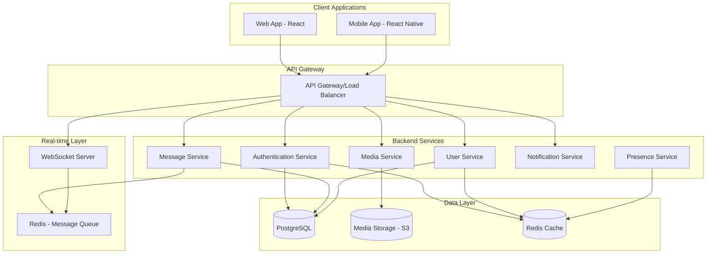

# Design Document

## Overview

The WhatsApp-like chat application will be built using a modern, scalable architecture that supports real-time communication across web and mobile platforms. The system will use WebSocket connections for real-time messaging, a microservices backend architecture, and shared data synchronization to ensure seamless cross-platform experiences.

## Architecture

### High-Level Architecture



### Technology Stack

**Frontend:**
- Web: React with TypeScript, Socket.io-client, Material-UI
- Mobile: React Native with TypeScript, Socket.io-client, React Native Elements

**Backend:**
- Runtime: Node.js with Express.js
- Real-time: Socket.io for WebSocket management
- Database: PostgreSQL for persistent data
- Cache: Redis for session management and real-time data
- Media Storage: AWS S3 or compatible object storage
- Message Queue: Redis for message queuing and pub/sub

**Infrastructure:**
- API Gateway: Nginx or AWS API Gateway
- Authentication: JWT tokens with refresh token rotation
- Encryption: End-to-end encryption using Signal Protocol
- Push Notifications: Firebase Cloud Messaging (FCM)

## Components and Interfaces

### Frontend Components

#### Web Application (React)
```typescript
// Core component structure
interface ChatAppProps {
  user: User;
  conversations: Conversation[];
  activeConversation: string | null;
}

interface ConversationListProps {
  conversations: Conversation[];
  onSelectConversation: (id: string) => void;
}

interface MessageViewProps {
  conversation: Conversation;
  messages: Message[];
  onSendMessage: (content: string, type: MessageType) => void;
}

interface ContactListProps {
  contacts: Contact[];
  onStartConversation: (contactId: string) => void;
}
```

#### Mobile Application (React Native)
```typescript
// Navigation structure
interface RootStackParamList {
  Auth: undefined;
  ChatList: undefined;
  Conversation: { conversationId: string };
  Profile: undefined;
  Settings: undefined;
}

// Shared components with web
interface MessageBubbleProps {
  message: Message;
  isOwn: boolean;
  showTimestamp: boolean;
}
```

### Backend Services

#### Authentication Service
```typescript
interface AuthService {
  registerUser(phoneNumber: string): Promise<{ verificationId: string }>;
  verifyPhone(verificationId: string, code: string): Promise<{ token: string, refreshToken: string }>;
  refreshToken(refreshToken: string): Promise<{ token: string }>;
  logout(userId: string, deviceId: string): Promise<void>;
}
```

#### Message Service
```typescript
interface MessageService {
  sendMessage(senderId: string, conversationId: string, content: MessageContent): Promise<Message>;
  getMessages(conversationId: string, limit: number, offset: number): Promise<Message[]>;
  markAsRead(userId: string, messageIds: string[]): Promise<void>;
  deleteMessage(messageId: string, userId: string): Promise<void>;
  searchMessages(userId: string, query: string): Promise<SearchResult[]>;
}
```

#### User Service
```typescript
interface UserService {
  createProfile(userId: string, profile: UserProfile): Promise<User>;
  updateProfile(userId: string, updates: Partial<UserProfile>): Promise<User>;
  syncContacts(userId: string, contacts: Contact[]): Promise<Contact[]>;
  blockUser(userId: string, targetUserId: string): Promise<void>;
  getPresence(userIds: string[]): Promise<PresenceStatus[]>;
}
```

#### Media Service
```typescript
interface MediaService {
  uploadMedia(file: File, userId: string): Promise<{ mediaId: string, url: string }>;
  getMediaUrl(mediaId: string): Promise<string>;
  deleteMedia(mediaId: string, userId: string): Promise<void>;
  generateThumbnail(mediaId: string): Promise<string>;
}
```

### Real-time Communication

#### WebSocket Events
```typescript
// Client to Server events
interface ClientEvents {
  'join-conversation': (conversationId: string) => void;
  'leave-conversation': (conversationId: string) => void;
  'send-message': (message: NewMessage) => void;
  'typing-start': (conversationId: string) => void;
  'typing-stop': (conversationId: string) => void;
  'mark-read': (messageIds: string[]) => void;
}

// Server to Client events
interface ServerEvents {
  'new-message': (message: Message) => void;
  'message-delivered': (messageId: string) => void;
  'message-read': (messageId: string, readBy: string) => void;
  'user-typing': (userId: string, conversationId: string) => void;
  'user-online': (userId: string) => void;
  'user-offline': (userId: string) => void;
}
```

## Data Models

### Core Entities

```typescript
interface User {
  id: string;
  phoneNumber: string;
  displayName: string;
  profilePicture?: string;
  status: string;
  lastSeen: Date;
  isOnline: boolean;
  createdAt: Date;
  updatedAt: Date;
}

interface Conversation {
  id: string;
  type: 'direct' | 'group';
  name?: string; // For group chats
  participants: string[]; // User IDs
  admins?: string[]; // For group chats
  lastMessage?: Message;
  lastActivity: Date;
  isArchived: boolean;
  isMuted: boolean;
  createdAt: Date;
  updatedAt: Date;
}

interface Message {
  id: string;
  conversationId: string;
  senderId: string;
  content: MessageContent;
  type: MessageType;
  timestamp: Date;
  deliveredTo: string[];
  readBy: string[];
  isDeleted: boolean;
  replyTo?: string; // Message ID
  editedAt?: Date;
}

interface MessageContent {
  text?: string;
  mediaId?: string;
  mediaType?: 'image' | 'video' | 'audio' | 'document';
  mediaUrl?: string;
  thumbnailUrl?: string;
  fileName?: string;
  fileSize?: number;
}

type MessageType = 'text' | 'image' | 'video' | 'audio' | 'document' | 'system';

interface Contact {
  id: string;
  userId: string;
  contactUserId?: string; // If contact is app user
  name: string;
  phoneNumber: string;
  isAppUser: boolean;
  isBlocked: boolean;
  addedAt: Date;
}
```

### Database Schema

```sql
-- Users table
CREATE TABLE users (
  id UUID PRIMARY KEY DEFAULT gen_random_uuid(),
  phone_number VARCHAR(20) UNIQUE NOT NULL,
  display_name VARCHAR(100) NOT NULL,
  profile_picture TEXT,
  status TEXT DEFAULT 'Available',
  last_seen TIMESTAMP WITH TIME ZONE DEFAULT NOW(),
  is_online BOOLEAN DEFAULT false,
  created_at TIMESTAMP WITH TIME ZONE DEFAULT NOW(),
  updated_at TIMESTAMP WITH TIME ZONE DEFAULT NOW()
);

-- Conversations table
CREATE TABLE conversations (
  id UUID PRIMARY KEY DEFAULT gen_random_uuid(),
  type VARCHAR(10) NOT NULL CHECK (type IN ('direct', 'group')),
  name VARCHAR(100),
  last_activity TIMESTAMP WITH TIME ZONE DEFAULT NOW(),
  is_archived BOOLEAN DEFAULT false,
  created_at TIMESTAMP WITH TIME ZONE DEFAULT NOW(),
  updated_at TIMESTAMP WITH TIME ZONE DEFAULT NOW()
);

-- Conversation participants
CREATE TABLE conversation_participants (
  conversation_id UUID REFERENCES conversations(id) ON DELETE CASCADE,
  user_id UUID REFERENCES users(id) ON DELETE CASCADE,
  is_admin BOOLEAN DEFAULT false,
  is_muted BOOLEAN DEFAULT false,
  joined_at TIMESTAMP WITH TIME ZONE DEFAULT NOW(),
  PRIMARY KEY (conversation_id, user_id)
);

-- Messages table
CREATE TABLE messages (
  id UUID PRIMARY KEY DEFAULT gen_random_uuid(),
  conversation_id UUID REFERENCES conversations(id) ON DELETE CASCADE,
  sender_id UUID REFERENCES users(id) ON DELETE CASCADE,
  content JSONB NOT NULL,
  type VARCHAR(20) NOT NULL,
  timestamp TIMESTAMP WITH TIME ZONE DEFAULT NOW(),
  is_deleted BOOLEAN DEFAULT false,
  reply_to UUID REFERENCES messages(id),
  edited_at TIMESTAMP WITH TIME ZONE
);

-- Message delivery status
CREATE TABLE message_status (
  message_id UUID REFERENCES messages(id) ON DELETE CASCADE,
  user_id UUID REFERENCES users(id) ON DELETE CASCADE,
  status VARCHAR(20) NOT NULL CHECK (status IN ('delivered', 'read')),
  timestamp TIMESTAMP WITH TIME ZONE DEFAULT NOW(),
  PRIMARY KEY (message_id, user_id, status)
);
```

## Error Handling

### Error Categories and Responses

```typescript
interface ApiError {
  code: string;
  message: string;
  details?: any;
  timestamp: Date;
}

// Authentication Errors
const AUTH_ERRORS = {
  INVALID_PHONE: { code: 'AUTH_001', message: 'Invalid phone number format' },
  VERIFICATION_FAILED: { code: 'AUTH_002', message: 'Verification code is invalid or expired' },
  TOKEN_EXPIRED: { code: 'AUTH_003', message: 'Authentication token has expired' },
  UNAUTHORIZED: { code: 'AUTH_004', message: 'User is not authorized for this action' }
};

// Message Errors
const MESSAGE_ERRORS = {
  CONVERSATION_NOT_FOUND: { code: 'MSG_001', message: 'Conversation not found' },
  MESSAGE_TOO_LARGE: { code: 'MSG_002', message: 'Message content exceeds size limit' },
  MEDIA_UPLOAD_FAILED: { code: 'MSG_003', message: 'Failed to upload media file' },
  INVALID_RECIPIENT: { code: 'MSG_004', message: 'Invalid recipient or blocked user' }
};

// Network Errors
const NETWORK_ERRORS = {
  CONNECTION_LOST: { code: 'NET_001', message: 'Connection to server lost' },
  TIMEOUT: { code: 'NET_002', message: 'Request timed out' },
  SERVER_ERROR: { code: 'NET_003', message: 'Internal server error' }
};
```

### Client-Side Error Handling Strategy

```typescript
interface ErrorHandler {
  handleAuthError(error: ApiError): void;
  handleNetworkError(error: ApiError): void;
  handleMessageError(error: ApiError): void;
  showUserFriendlyMessage(error: ApiError): void;
  retryFailedOperation(operation: () => Promise<any>): Promise<any>;
}

// Retry logic for failed messages
interface MessageRetryConfig {
  maxRetries: number;
  backoffMultiplier: number;
  initialDelay: number;
}
```

## Testing Strategy

### Unit Testing
- **Frontend**: Jest + React Testing Library for components
- **Backend**: Jest + Supertest for API endpoints
- **Database**: Test database with migrations and seed data
- **Real-time**: Mock Socket.io connections for WebSocket testing

### Integration Testing
- **API Integration**: Test complete request/response cycles
- **Database Integration**: Test data persistence and retrieval
- **WebSocket Integration**: Test real-time message flow
- **Cross-platform**: Test data synchronization between web and mobile

### End-to-End Testing
- **User Flows**: Cypress for web, Detox for React Native
- **Multi-device**: Test message synchronization across devices
- **Performance**: Load testing for concurrent users and message throughput

### Test Data Management
```typescript
interface TestDataFactory {
  createUser(overrides?: Partial<User>): User;
  createConversation(participants: string[], type?: 'direct' | 'group'): Conversation;
  createMessage(conversationId: string, senderId: string, content: string): Message;
  createTestDatabase(): Promise<void>;
  cleanupTestData(): Promise<void>;
}
```

### Performance Testing
- **Load Testing**: Simulate 1000+ concurrent users
- **Message Throughput**: Test message delivery under high load
- **Database Performance**: Query optimization and indexing validation
- **Media Upload**: Test large file uploads and processing

### Security Testing
- **Authentication**: Test token validation and refresh mechanisms
- **Authorization**: Verify user access controls
- **Input Validation**: Test against injection attacks
- **Encryption**: Validate end-to-end encryption implementation